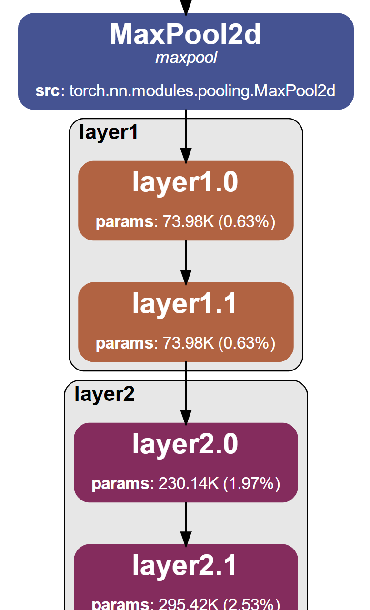
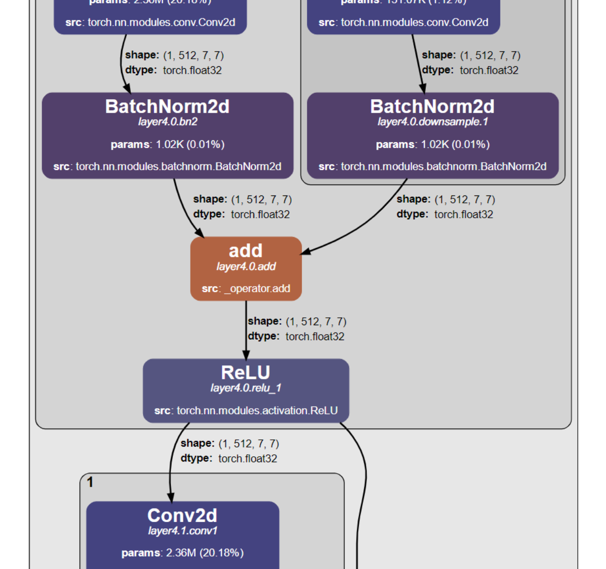

# NNViz

NNViz is a python package to visualize neural networks in a comprehensible way. It is based on [Graphviz](https://graphviz.org/) and [PyTorch](https://pytorch.org/). 

 

More PDFs examples can be found in the `examples` folder.

## Installation

Make sure you have a working installation of [Graphviz](https://graphviz.org/) on your system.
- If you are using Windows, graphviz dependencies are easily installable with conda, so consider using [Miniconda](https://docs.conda.io/en/latest/miniconda.html) or [Anaconda](https://www.anaconda.com/products/individual) instead of the plain Python distribution. Trying to install graphviz without conda is generally associated with symptoms like headaches, asphyxiation, and death.
- Linux users can install graphviz with their package manager (e.g. `sudo apt install graphviz` on Ubuntu).

Then:

```bash
pip install nnviz
```

## Usage

Currently, nnviz is supposed to be used via its CLI, and not as a library. 

You can display everything there is to know by entering:
```bash
nnviz --help
```

### Examples

Visualize a resnet18 to a file named `resnet18.pdf` in the current directory:
```bash
nnviz resnet18
```

Visualize and show (with the default app) a resnet18:
```bash
nnviz resnet18 -s
```

Visualize a resnet18 and save to a custom file:
```bash
nnviz resnet18 -o my_resnet18.pdf
```

Visualize a resnet18 and collapse to a custom depth:
```bash
nnviz resnet18 -d 3
```

Visualize a custom model imported from an installed package:
```bash
nnviz package.module.submodule:MyModelConstructor
```

Visualize a custom model imported from a local file:
```bash
nnviz path/to/file.py:MyModelConstructor
```

**!!!NEW!!!**
Also visualize data format in edges by passing an input tensor to the model:
```bash
nnviz resnet18 -i default
```

## Why NNViz

Do you want to visualize a torch.nn.Module in a comprehensible way? Here are some options for you:

### Netron

[Netron](https://github.com/lutzroeder/netron) is a web-based viewer for neural network, deep learning and machine learning models. It supports `ONNX`, `Keras`, `CoreML`, `Caffe`, `Caffe2`, `MXNet`, `Darknet`, `TensorFlow`, `PyTorch`, `TorchScript`, `CoreML` and `PaddlePaddle` models. 

Cool huh? No. It sucks ass:

- You have to compile your models to ONNX runtime - which can be a pain in the ass and 90% of the times requires you to apply changes to your code. 
- Try to visualize a simple resnet18. You will get an endless clusterfuck of incomprehensible nodes that cannot be collapsed or reduced in any way. This is not useful. 

### Torchviz

[Torchviz](https://github.com/szagoruyko/pytorchviz) is really just a toy project that just displays the backpropagation graph:

- Module hierarchy is not tracked/displayed.
- Cannot collapse nodes.
- Limited to differentiable models.

### Torchview

[Torchview](https://github.com/mert-kurttutan/torchview) seems pretty cool. I did not know of its existence when I started developing nnviz, and in fact was developed in the same period. 

Well, they do pretty much everything that nnviz does, take a look at their style, and come back here. :D
