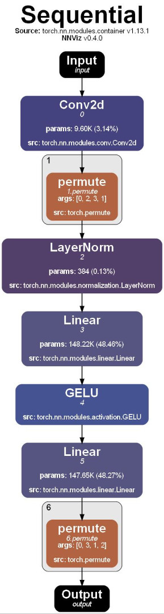

# 📊 NNViz

NNViz is a python package to visualize neural networks in a comprehensible way. It is based on [Graphviz](https://graphviz.org/) and [PyTorch](https://pytorch.org/). 

 

More PDFs examples can be found in the `examples` folder.

# 🧰 Installation
Make sure you have a working installation of [Graphviz](https://graphviz.org/) on your system.
- If you are using Windows, graphviz dependencies are easily installable with conda, so consider using [Miniconda](https://docs.conda.io/en/latest/miniconda.html) or [Anaconda](https://www.anaconda.com/products/individual) instead of the plain Python distribution. Trying to install graphviz without conda is generally associated with symptoms like headaches, asphyxiation, and death.
- Linux users can install graphviz (and graphviz-dev) with their package manager (e.g. `sudo apt install -y graphviz graphviz-dev` on Ubuntu).

Then:

```bash
pip install nnviz
```

# 🖥️ CLI Usage

Currently, nnviz is supposed to be used via its CLI, and not as a library. A proper API will be added in the future, most likely with the 1.x release. Anyway, the CLI can do a lot of things, and it is pretty easy to use.

I will try to explain the most important things here, but you can always display everything there is to know by entering:
```bash
nnviz --help
```

The only entry point of NNViz is the `nnviz` command that in its simplest form does roughly the following:
1. Load a model from torchvision, a local file or an installed package.
2. Perform a symbolic trace of the model and extract a graph representation of it.
3. Draw the graph representation to a pdf file named after the model.

Additional behavior is controlled by a set of options and flags that can be passed to the command.

## 🔥 Visualizing built-in torchvision models

You can visualize any model from torchvision by passing its name to the `nnviz` command.
```bash
nnviz resnet18
nnviz efficientnet_b0
nnviz convnext_tiny
```

  

These models are saved to a pdf file named after the model in the current working directory.

## 📦 Visualizing models from installed packages

Being limited to torchvision models is not very useful, so you can also visualize models from any installed package, as long as they are importable. To do so, you need to pass the fully qualified name of a python function (or class constructor) that returns an instance of the model you want to visualize.

```bash
nnviz package.module.submodule:MyModelConstructor
nnviz package.module.submodule:a_function_that_returns_a_model
```

⚠️**NOTE:** Currently, there is a limitation with this feature: the model constructor **must** take no arguments (or at least no required ones), because I cannot find a way to easily pass arguments to the constructor from the command line. A workaround is to manually create a python file with a function that returns the model, and then pass that function to the `nnviz` command. I know, it's not ideal, this will be fixed in the 0.5.x release.

## 🐍 Visualizing models from python files

And if want to visualize a model that is not in a package, you can also pass a path to a python file that contains the model constructor. NNViz will attempt to dynamically import the file and extract the model constructor from it.
```bash
nnviz path/to/file.py:MyModelConstructor
nnviz path/to/file.py:a_function_that_returns_a_model
```

⚠️**NOTE:** Currently, there is a limitation with this feature: the model constructor **must** take no arguments (or at least no required ones), because I cannot find a way to easily pass arguments to the constructor from the command line. A workaround is to manually create a python file with a function that returns the model, and then pass that function to the `nnviz` command. I know, it's not ideal, this will be fixed in the 0.5.x release.

## 📑 Choosing a different output file
Saving the pdf to the current working directory is not very useful, so you can also pass a path to a different file to the `nnviz` command using the `-o` or `--out` option.
```bash
nnviz resnet18 -o my_resnet18.pdf
nnviz resnet18 -o my_resnet18.png
nnviz resnet18 -o my_resnet18.svg
nnviz resnet18 --out /very/custom/path/to/wow.pdf
```

## 📜 Dumping/Loading the graph representation

If you plan to create multiple visualizations of the same model, you can use JSON files to store the graph representation of the model, and then load it from the file instead of performing a symbolic trace every time, which, if done repeatedly, can become quite slow.

To dump the graph representation to a JSON file, you can pass the `-j` or `--json` flag to the `nnviz` command.
The JSON file will be saved together with the pdf file, just with a ".json" extension instead of ".pdf".
```bash
nnviz resnet18 -j
nnviz resnet18 --json
nnviz resnet18 -j -o /very/custom/path/to/wow.pdf
```

In the third example (above), the JSON file will be saved to `/very/custom/path/to/wow.json`.

Ok, but once you have the JSON file, how do you load it? Well, you can pass the path to the JSON file to the `nnviz` command as if it was a model name, and it will load the graph representation from the file instead of performing a trace, and it will be blazing fast.
```bash
nnviz /very/custom/path/to/wow.json
```

## 🖼️ Displaying the output file (for the laziest people)

If you happen to be too lazy to open the pdf file manually, or press the `F5` key to refresh the file explorer, you can also pass the `-s` or `--show` flag to the `nnviz` command to automatically open the generated file with the default app associated to the specified file type.
```bash
nnviz resnet18 -s
nnviz resnet18 --show
```

## 🪓 Plotting only a specific submodule

Sometimes you may be interested in visualizing only a specific submodule instead of the whole thing. To do so, you can pass the `-l` or `--layer` option to the `nnviz` command, followed by the name of the submodule you want to visualize. The submodule can be specified using a dot-separated path, just like you would do in python.
```bash
nnviz resnet18 -l layer2.0
nnviz convnext_tiny -l features.3.0.block
```

This will only plot the specified submodule and all of its children and save the result to a pdf file named after the submodule. For example, in the first example above, the pdf file will be named `resnet18_layer2-0.pdf` and in the second, `convnext_tiny_features-3-0-block.pdf`. You can always change the name of the output file using the `-o` or `--out` option.

 

## 🌂 Reducing the complexity of the graph

With NNViz, you can also collapse groups of nodes into a single "collapsed" node to reduce the complexity of the graph and improve readability. Currently the CLI allows to do so by two different methods:
- **Collapse by depth**: merge together all nodes that have a depth greater than a specified value. The "depth" of a node is the number of nested submodules it is contained in. 
- **Collapse by name**: merge together all nodes that share the same path prefix. This is useful in case you want a detailed view of a specific submodule, but you don't care about the details of the other ones.

The depth collpsing is enabled by default and set to 2, which in most cases is enough to reduce the complexity of the graph without losing too much information. You can change the depth by passing the `-d` or `--depth` option to the `nnviz` command, followed by the desired depth.

Set the depth to -1 to disable depth collapsing and plot the whole graph.

```bash
nnviz efficientnet_b0 -d 1
nnviz efficientnet_b0 -d 2
nnviz efficientnet_b0 -d 3
nnviz efficientnet_b0 --depth -1
```

   

To collapse by name, you can pass the `-c` or `--collapse` option to the `nnviz` command, followed by a path prefix. The path prefix can be specified using a dot-separated path, just like you would do in python. You can use this option multiple times to collapse multiple groups of nodes.

```bash
nnviz efficientnet_b0 --depth -1 --collapse features
```

Here, the "classifier" will be fully displayed, but the "features" submodule will be collapsed into a single node.

## 🧮 Data tracing

Besides the graph representation of the model, NNViz can also trace the data flow through the model and represent the data as labels attached to each graph edge. This is useful to understand how the data is transformed by the model and to identify potential bottlenecks in the model.

Data tracing cannot be done with a simple symbolic trace, because the data is not available at that point. We need to actually run the model on some bogus data to get the data flow, which can be more expensive in terms of both time and resources. For this reason data tracing is disabled by default.

To enable data tracing, just provide an input to the model. You can do with the `-i` or `--input` option to the `nnviz` command, followed by a string representing the input you want to pass. 

Parsing complex tensor data from CLI is not easy, NNViz will try its best, but you may need to pass the input data as python code.

Supported input types:
- `default`: The default tensor used most commonly for image classification models. Equivalent to python code: 
    ```python
    {"x": torch.randn(1, 3, 224, 224)}
    ```
- `image<side>`: A square image with the specified side (e.g. `image256`, `image64`, `image241`...). Equivalent to python code:
    ```python
    {"x": torch.randn(1, 3, side, side)}
    ``` 
- `image<height>x<width>`: An image with the specified height and width (e.g. `image256x256`, `image64x64`, `image241x241`...). Equivalent to python code:
    ```python
    {"x": torch.randn(1, 3, height, width)}
    ```
- `tensor<shape>`: A tensor with the specified shape (e.g. `tensor18x23`, `tensor30`, `tensor4x5x256`...). Equivalent to python code:
    ```python
    {"x": torch.randn(*shape)}
    ```
- `<key1>:<value1>;<key2>:<value2>;...`: A dictionary of key-value pairs. Keys are strings and values can be any of the above types. This is especially useful for models that take multiple inputs, or have an input name different from `x`.
- Plain python code. If the input string is not recognized as one of the above types, it will be evaluated as python code. This is useful if you want to pass a more complex input, like a list of tensors, or a dictionary of tensors. When using python code you will have the module `torch` already imported, so you can use it to create tensors. Example:
    ```python
    {"x": torch.randn(1, 3, 224, 224), "y": [torch.randn(1, 3, 224, 224), torch.randn(1, 3, 224, 224)]}
    ```

⚠️**NOTE:** You cannot just spam "default" into every model that comes to your mind. To perform data tracing you need to pass something that makes sense for the model. For example, if you pass an image to a linear model, the data tracing will fail, so it will default to the basic graph representation.

Let's see some examples:

```bash
nnviz resnet18 -i default
```


As you can see, every edge is now labeled with the shape of the tensor that flows through it. 

And what if the data is not a tensor? I thought of that too! NNViz can also represent nested lists and dictionaries as HTML tables.


## 🎨 Customizing the graph

NNViz also allows you to customize the graph representation of the model using the `-S` or `--style` option. Currently there are limited style options, but I plan to add more in the future. You can pass multiple style options at once, providing the `-S` option multiple times.

Style options are passed as a string in the form `key=value`. Don't worry about the type of the value, it will be automatically inferred by pydantic. The available options are:
- `fontname`: str - The font to use for the graph. Default is "Arial". 
- `default_node_color`: str - The default color for nodes (in case the colorizer fails to return a color). Default is "gray". 
- `default_edge_color`: str - The default color for edges. Default is "black". 
- `node_style`: str - The style for nodes. See graphviz docs for details. Default is "rounded,filled". 
- `node_margin`: str - The horizontal and vertical margin for nodes. See graphviz docs for details. Default is "0.2,0.1". 
- `edge_thickness`: str - The thickness of edges. Default is "2.0". 
- `graph_title_font_size`: int - The font size for the graph title. Default is 48.
- `node_title_font_size`: int - The font size for the node title. Default is 24. 
- `cluster_title_font_size`: int - The font size for the cluster title. Default is 18. 
- `show_title`: bool - Whether to show the graph title. Default is True. 
- `show_specs`: bool - Whether to show the specs as a label for each edge. Default is True.
- `show_node_name`: bool - Whether to show the node name (just below the title). Default is True.
- `show_node_params`: bool - Whether to show the count of parameters for each node. Default is True.
- `show_node_arguments`: bool - Whether to show the arguments for each node. Default is True.
- `show_node_source`: bool - Whether to show the source of each node. Default is True.
- `show_clusters`: bool - Whether to show the clusters as gray subgraphs. Default is True.

# Why NNViz

Do you want to visualize a torch.nn.Module in a comprehensible way? Here are some options for you:

## Netron

[Netron](https://github.com/lutzroeder/netron) is a web-based viewer for neural network, deep learning and machine learning models. It supports `ONNX`, `Keras`, `CoreML`, `Caffe`, `Caffe2`, `MXNet`, `Darknet`, `TensorFlow`, `PyTorch`, `TorchScript`, `CoreML` and `PaddlePaddle` models. 

Cool huh? No. It sucks ass:

- You have to compile your models to ONNX runtime - which can be a pain in the ass and 90% of the times requires you to apply changes to your code. 
- Try to visualize a simple resnet18. You will get an endless clusterfuck of incomprehensible nodes that cannot be collapsed or reduced in any way. This is not useful. 

## Torchviz

[Torchviz](https://github.com/szagoruyko/pytorchviz) is really just a toy project that just displays the backpropagation graph:

- Module hierarchy is not tracked/displayed.
- Cannot collapse nodes.
- Limited to differentiable models.

## Torchview

[Torchview](https://github.com/mert-kurttutan/torchview) seems pretty cool. I did not know of its existence when I started developing nnviz, and in fact was developed in the same period. 

Well, they do pretty much everything that nnviz does, take a look at their style, and come back here. :D
