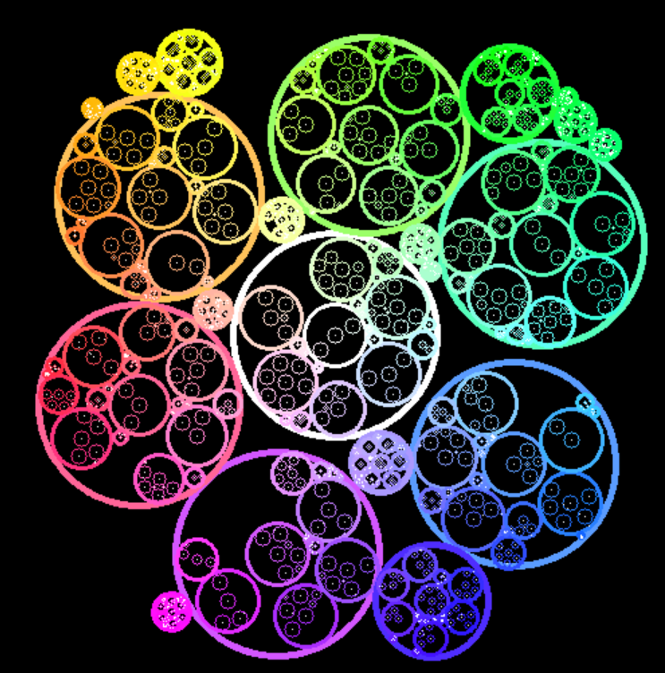

# 🌈 Coloring

You may have noticed that the nodes in the graph are colored. But who decides the color of each node? 

Currently, the color mapping is done by the `nnviz.colors.ColorPicker` base class. There are two implementations available at the moment:

- `nnviz.colors.HashColorPicker`
- `nnviz.colors.BubbleColorPicker`	

*Names are completely arbitrary and meaningless.*

The `ColorPicker` interface is very simple, it has a single method:

```python
def pick(self, *args: t.Hashable) -> RGBColor:
```

This method receives a variable number of arguments, and returns a `RGBColor`. The arguments can be anything that can be hashed (no mutable objects allowed).

## HashColorPicker

Hash color picker simply hashes the arguments and maps them to a color. This means that the same arguments will always be mapped to the same color. This is useful if you want to have a consistent color mapping between different runs of the same program. 

```{admonition} Warning
:class: warning
The hash color picker is ugly as hell. It's really surprising how bad the colors look. Maybe I will delete it in the future.
```

Example:

```python
from nnviz.colors import HashColorPicker

picker = HashColorPicker()

picker.pick("a", "b", "c").hex
# '#c375f3'

picker.pick(10, "babab", 0.24, ("hello", 10)).hex
# '#9bb462'
```

```{admonition} Note
The color space is quantized to 24 bits, so there is no guarantee that the colors will be unique. Please don't sue me if you get a collision, it happens.
```

## BubbleColorPicker

Bubble color picker is a bit more complex. It tries to partition the color space into "bubbles" of colors, and bubbles are recursively partitioned into smaller ones, until the color space is exhausted by this tree-like structure.

The n-th argument is used to select the n-th-level bubble. Therefore paths sharing the same prefix will also share similar colors. This is useful if you want to have a consistent color mapping between different runs of the same program, but also want to have some visual grouping of the nodes.

To debug the color picker I created a small script that partitions a 2D space and draws colored bubbles on an OpenCV (need to run it). The script is available at `examples/code/bubble_color_debugger.py`. Here is an example of the output:

<p align="center">
    
</p>
<p align="center"><i>What happens if you run bubble_color_debugger.py</i></p>

The algorithm does not know how many bubbles it will need to spawn, so it will try to allocate as many as possible, gradually reducing the size of the bubblesm, as you can notice from the smaller bubbles among the leftout space between the big ones.

It is really just a big trip, but it's fun to watch. I will probably write a better color picker in the future, but for now this is what we have.

```{admonition} Note
This color picker will not guarantee that a sequence of arguments will always be mapped to the same color. This is because the color space is partitioned dynamically, and the color picker is stateful. 
```