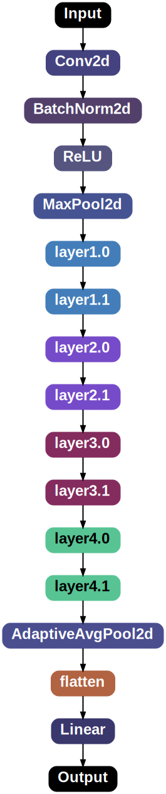

# 🎨 Customization

NNViz also allows you to **customize** the graph representation of the model using the `-S` or `--style` option. Currently there are limited **style options**, but I plan to add more in the future. You can pass **multiple** style options at once, providing the `-S` option multiple times.

Style options are passed as a string in the form `key=value`. Don't worry about the type of the value, it will be automatically **inferred by pydantic**. The available options are:
- `fontname`: str - The font to use for the graph. Default is "Arial". 
- `default_node_color`: str - The default color for nodes (in case the colorizer fails to return a color). Default is "gray". 
- `default_edge_color`: str - The default color for edges. Default is "black". 
- `node_style`: str - The style for nodes. See graphviz docs for details. Default is "rounded,filled". 
- `node_margin`: str - The horizontal and vertical margin for nodes. See graphviz docs for details. Default is "0.2,0.1". 
- `edge_thickness`: str - The thickness of edges. Default is "2.0". 
- `graph_title_font_size`: int - The font size for the graph title. Default is 48.
- `node_title_font_size`: int - The font size for the node title. Default is 24. 
- `cluster_title_font_size`: int - The font size for the cluster title. Default is 18. 
- `show_title`: bool - Whether to show the graph title. Default is True. 
- `show_specs`: bool - Whether to show the specs as a label for each edge. Default is True.
- `show_node_name`: bool - Whether to show the node name (just below the title). Default is True.
- `show_node_params`: bool - Whether to show the count of parameters for each node. Default is True.
- `show_node_arguments`: bool - Whether to show the arguments for each node. Default is True.
- `show_node_source`: bool - Whether to show the source of each node. Default is True.
- `show_clusters`: bool - Whether to show the clusters as gray subgraphs. Default is True.

Let's try to disable everything that can be disabled via the style options:

```bash
nnviz resnet18 -S show_title=False -S show_specs=False -S show_node_name=False -S show_node_params=False -S show_node_arguments=False -S show_node_source=False -S show_clusters=False
```

<p align="center" style="overflow-y:scroll; height:400px;">
    
</p>
<p align="center"><i>Minimal NNViz visualization</i></p>