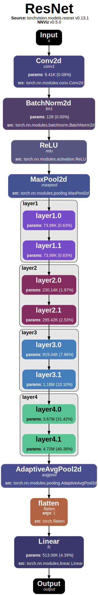
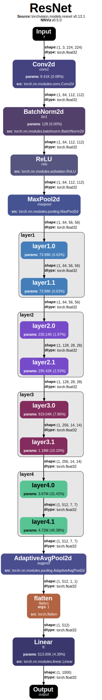
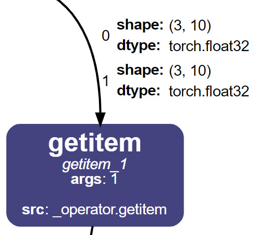

# 🧮 Data Tracing

Besides the graph representation of the model, NNViz can also **trace the data flow** through the model and represent the data as labels attached to each graph edge. This is useful to understand how the data is transformed by the model and to identify potential bottlenecks in the model.

```{md-mermaid}
graph LR
    A[Operation1] -- Data1 --> B[Operation2]
    B -- Data2 --> C[Operation3]
    C -- Data3 --> D[...]
```

Data tracing cannot be done with a simple symbolic trace, because the data is not available at that point. We need to actually **run the model** on some bogus data to get the data flow, which can be more expensive in terms of both time and resources. For this reason data tracing is disabled by default.

To enable data tracing, just **provide an input** to the model. You can do with the `-i` or `--input` option to the `nnviz` command, followed by a string representing the input you want to pass. 

Parsing complex tensor data from CLI is not easy, NNViz will try its best, but you may need to pass the input data as python code or switch to the API usage.

Supported input types:
- `default`: The **default tensor** used most commonly for image classification models. Equivalent to python code: 
    ```python
    {"x": torch.randn(1, 3, 224, 224)}
    ```
- `image<side>`: A **square image** with the specified side (e.g. `image256`, `image64`, `image241`...). Equivalent to python code:
    ```python
    {"x": torch.randn(1, 3, side, side)}
    ``` 
- `image<height>x<width>`: An **image** with the specified height and width (e.g. `image256x256`, `image64x64`, `image241x241`...). Equivalent to python code:
    ```python
    {"x": torch.randn(1, 3, height, width)}
    ```
- `tensor<shape>`: A **tensor** with the specified shape (e.g. `tensor18x23`, `tensor30`, `tensor4x5x256`...). Equivalent to python code:
    ```python
    {"x": torch.randn(*shape)}
    ```
- `<key1>:<value1>;<key2>:<value2>;...`: A dictionary of **key-value pairs**. Keys are strings and values can be any of the above types. This is especially useful for models that take **multiple inputs**, or have an input name different from `x`.
- Plain **python code**. If the input string is not recognized as one of the above types, it will be evaluated as python code. This is useful if you want to pass a more complex input, like a list of tensors, or a dictionary of tensors. When using python code you will have the module `torch` already imported, so you can use it to create tensors. Example:
    ```python
    {"x": torch.randn(1, 3, 224, 224), "y": [torch.randn(1, 3, 224, 224), torch.randn(1, 3, 224, 224)]}
    ```

```{Warning}
You cannot just spam "default" into every model that comes to your mind. To perform data tracing you need to **pass something that makes sense** for the model. For example, if you pass an image to a linear model, the data tracing will fail, so it will default to the basic graph representation.
```

Let's compare the output with and without data tracing.

```bash
nnviz resnet18
nnviz resnet18 -i default
```

<p align="center" style="overflow-y:scroll; height:400px;">
    
    
</p>
<p align="center"><i>Resnet 18 visualized without (left) and with (right) data tracing</i></p>

As you can see, every edge is now labeled with the shape of the tensor that flows through it. 

And what if the data is not a tensor? I thought of that too! NNViz can also represent nested lists and dictionaries as HTML tables.

<p align="center">
    
</p>