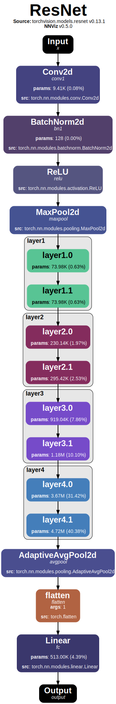

# ⭕ Intro

In this section we will cover the basic **CLI usage** of NNViz, which is probably the most common use case for quickly glancing at a model inner structure. I will try to keep it as simple as possible, gradually adding more advanced features as we go.

## Visualizing a Model

Visualizing a model with NNViz is very simple. This is the **minimal command** that you need to run, keeping all the options at their default values. We will use a **resnet18** model from **torchvision** as an example.

```bash
nnviz resnet18
```

This command will generate a file called `resnet18.pdf` in your current working directory. This file contains a visualization of the model, which you can open with any PDF viewer, like your internet browser. 

```{Note}
By default, NNViz automatically loads models from the `torchvision.models` module. This is done because it is very common to use models from this module, and it is a bit annoying to have to write `torchvision.models.XXX` every time. If you want to use a model from somewhere else, just pass the full path to a function that returns the model, like `my_module.my_model`.
```

The generated PDF file will look something like this:

<p align="center" style="overflow-y:scroll; height:400px;">
    
</p>
<p align="center"><i>Resnet18 visualized with NNViz CLI</i></p>

By default, you will get a (hopefully) clear graph representation of all the model operations, up to a certain level of nesting. We will later see how to change this behavior, but for now, let's just focus on the **default** visualization. The top portion of the graph contains a **title** and where does the model come from, in my case `torchvision.models.resnet`, along with the torchvision version (0.13.1). The graph starts and ends with two nodes named `Input` and `Output`, each reporting also the identifier name. All the nodes in between represent the exact operations that are performed by the model in its forward pass. Each of them has a **title** that describes the operation, an **identifier**, the absolute and relative **number of parameters** and the **source code** location.

Some nodes are wrapped in gray boxes, which means that they are **nested** inside other nodes. We will see later how to change this behavior, increasing or decreasing the maximum level of nesting.

## Getting Help

You can print a CLI **help** message by running:

```bash
nnviz --help
```

This will print a full list of all the available **options**, default **values**, and **descriptions**. You can also refer to this documentation for more in-depth explanations of the CLI functionality.

## Auto-Opening the Output

By default, NNViz will not **open** the generated PDF file automatically, but you can change this behavior by passing the `-s` or `--show` flag:

```bash
nnviz resnet18 -s
```

And you will notice that the default PDF viewer will open automatically, displaying the generated visualization.