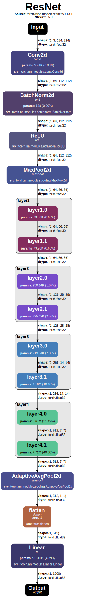
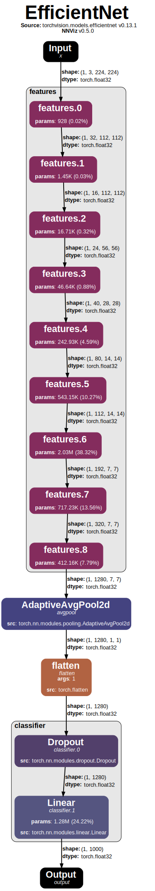

#  Welcome to NNViz Docs!

Welcome to **NNViz**! This documentation aims to explain all the features of NNViz at different levels of detail. NNViz is still a rather small and self-contained project, so there is still no need for a huge documentation, however, I feel that the github README is rapidly becoming too long to hold all the information, so I decided to create a separate, more organized and scalable documentation site.

If you want a rapid and more concise overview of the project, the **github README** is still the best place to start. If, on the other hand, you want to learn more about the project, or you want to contribute to it, then this is the place for you.

## What is NNViz?

Sometimes when working with **neural networks**, it is hard to understand what is going on inside them, especially when their structure is hidden behind a complex OOP architecture, that makes them scalable and modular, but also **hard to conceptualize**. NNViz is a python package to visualize complex neural networks as **hierarchical graphs**, letting the user choose the level of abstraction and hiding the unnecessary design and implementation details. 

<p align="center" style="overflow-y:scroll; height:400px;">
    
    
</p>
<p align="center"><i>Resnet18 and EfficientNetB0 visualized with NNViz</i></p>

NNViz is based on [Graphviz](https://graphviz.org/) and [PyTorch](https://pytorch.org/) and can be used to visualize any PyTorch model, built-in or custom, as long as it has **no dynamic control flow** (i.e. logic that depends on the input data). While this seems like a big limitation, it is actually not that bad, since vast majority of the models that are used in practice are static. Also, in case your model has some dynamic behaviors, you can still use NNViz to visualize the static parts.

## What's in the docs?

Here is a list of the main sections of the documentation:

```{toctree}
:maxdepth: 1
:caption: 🚀 Getting Started
getting_started/installation.md
getting_started/basics.md
```

```{toctree}	
:maxdepth: 1
:caption: 🖥️ CLI Usage
cli/intro.md
cli/models.md
cli/io.md
cli/simplifying.md
cli/data_tracing.md
cli/customization.md
```

```{toctree}
:maxdepth: 1
:caption: ⚙️ API Usage
api_/intro.md
api_/entities.md
api_/coloring.md
```

```{toctree}
:maxdepth: 3
:caption: 📚 API Reference
api/generated/nnviz.rst
```